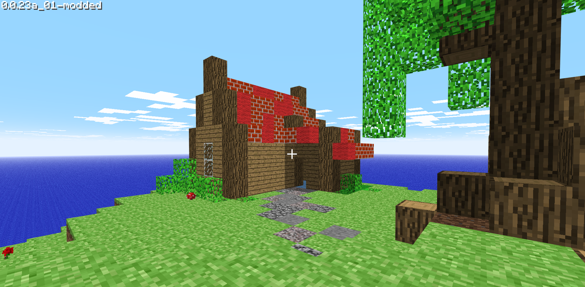

# js0.23-improved

**Hey! I have little interest in maintaining the project anymore. If anyone is willing to take over, feel free to email me :)**

This project aims to improve upon js0.23 ([classic.minecraft.net](https://classic.minecraft.net)) by adding features to make it closer to the original, or just stuff I like myself.

- Electron application
- Tweaked menus
- Good mouse controls
- Custom main menu
- Seeds
- Custom default settings
- Fixed sounds not playing when placing blocks (this wasn't in the original, which I didn't like)
- Hidden credits screen
- Custom commands (/say, /tele, /seed)
- No grass spread on player placed blocks
- Better pitched bush sounds (but I also like the low sound, so it's a bit lower than the original)
- All items are obtainable
- Somewhat improved movement
- Simple flying mode (made by a mod developer at the now defunct <https://mod.heathmitchell1.repl.co>)

## Running this

```shell
git clone git@github.com:RobinBoers/js0.23-improved
cd js0.23-improved
npm i # Optional, if you want the Electron version
cd src
python3 -m http.server 4000
```

Access the game at [localhost:4000](http://localhost:4000). The modded client is disabled by default. You can turn it on in the settings screen.

Sidenote: I don't know whether the Electron client still works.

## Contributing

If you have cool ideas, bugfixes, suggestions or anything else,
feel free to contribute to the project by making a pull request!  
[Read more about contributing to this project](CONTRIBUTING.md)

## Thanks to

- [TheSunCat](https://github.com/TheSunCat/Minecraft-Classic-Reversed), who documented large parts of the code.  
- Alawnely, who has [this great video](https://www.youtube.com/watch?v=SFom-RNcLps&t=586s) about modding js0.23.
- The js0.23 modding community.

## Takedown

This project is just meant as a fun thing to make. If it needs to be taken down  
for legal reasons, please create a new issue at the issues tab.


